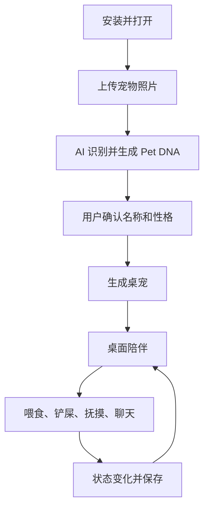

# 02 MVP

## MVP 目标

用 4 到 8 周做出第一版可运行产品，验证三个问题：

- 用户是否愿意上传真实宠物照片。
- 用户是否愿意长期打开桌宠。
- 用户是否认为 AI 记忆和养成值得付费。

## 功能清单

### 必须有

- 宠物照片上传
- 宠物名称设置
- 宠物类型选择或识别：猫、狗、鸟、兔子
- Pet DNA 创建
- 桌宠透明窗口
- 桌宠基础动作：Idle、Walk、Sleep、Eat、Happy
- 喂食
- 铲屎
- 抚摸
- 基础聊天
- 状态面板：饱食度、心情、清洁度、亲密度、等级
- 本地缓存
- 后端数据持久化

### 应该有

- 图片上传失败重试
- AI 生成失败降级为手动创建
- 桌宠隐藏与显示
- 系统托盘
- 开机启动开关
- 简单主动提醒

### 暂不做

- 支付
- 复杂商城
- 插件系统
- 多用户社交
- 动态视频生成
- 高级语音

## MVP 用户闭环

## 成功标准

- 首次创建完成率达到 60% 以上。
- 次日再次打开率达到 30% 以上。
- 用户平均每天互动 5 次以上。
- 至少 30% 的测试用户认为长期记忆值得付费。

