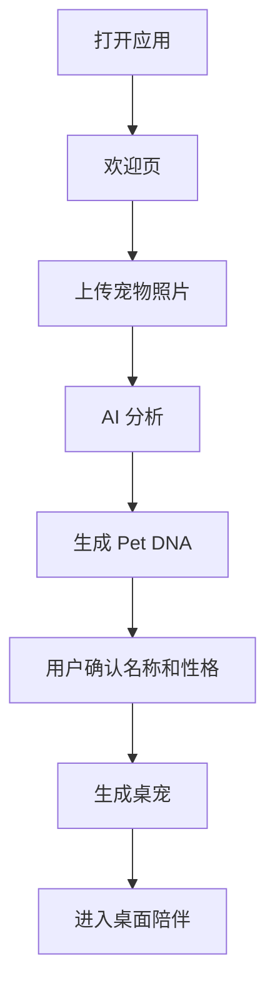

# 04 User Journey

## 首次使用

## Day 1

用户第一次创建宠物，重点是惊喜和低门槛。

体验目标：

- 快速看到宠物出现在桌面。
- 明确知道可以喂食、抚摸、聊天。
- 形成“这是我的宠物”的归属感。

## Day 7

用户已经完成多次互动，重点是养成感。

体验目标：

- 宠物能体现亲密度变化。
- 宠物能主动说出与用户行为相关的短句。
- 用户能看到成长记录。

## Day 30

用户进入长期陪伴阶段，重点是记忆价值。

体验目标：

- 宠物能记住用户偏好。
- 宠物能根据时间、工作状态、互动历史表达差异化行为。
- 用户开始愿意为高级记忆和更多动作付费。

## 失败流程

### 照片识别失败

系统应提示用户重新上传更清晰照片，并提供手动创建入口。

### AI 生成超时

系统应展示明确进度和重试按钮，不阻塞用户退出当前流程。

### 后端不可用

桌宠应进入本地模式，保留基础互动和状态保存。

