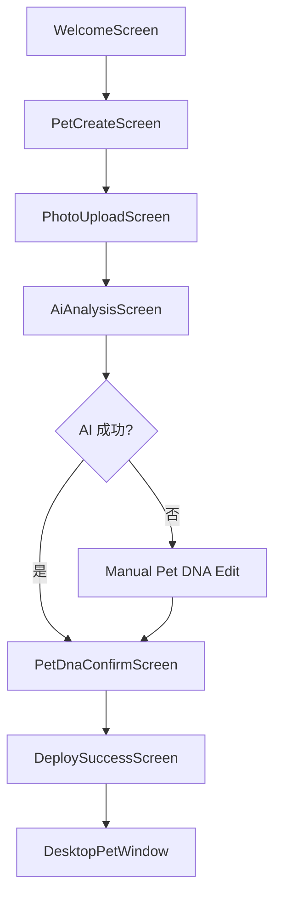

# MVP Screen Flow

## 目标

定义 MVP 所有用户可见屏幕和面板的流程，避免前端实现时自由发挥。

## 屏幕清单

MVP 包含：

- WelcomeScreen
- PetCreateScreen
- PhotoUploadScreen
- AiAnalysisScreen
- PetDnaConfirmScreen
- DeploySuccessScreen
- DesktopPetWindow
- PetInteractionPanel
- ChatPanel
- SettingsPanel
- ErrorPanel

## 首次创建流程

## WelcomeScreen

目的：

- 说明产品价值。
- 引导用户创建第一只宠物。

主操作：

- 创建我的宠物

次操作：

- 稍后再说

## PetCreateScreen

字段：

- 宠物名称
- 宠物类型
- 生日
- 简短描述

主操作：

- 下一步

禁用条件：

- 名称为空
- 类型为空

## PhotoUploadScreen

状态：

- 空态：展示上传区域。
- 上传中：展示进度。
- 成功：展示预览图。
- 失败：展示错误和重试。

主操作：

- 上传照片
- 下一步生成

次操作：

- 跳过，手动创建

## AiAnalysisScreen

展示：

- 当前任务状态
- 进度文案
- 可取消入口

文案示例：

- 正在识别颜色
- 正在分析性格
- 正在生成 Pet DNA

失败时进入 ErrorPanel，允许重试或手动创建。

## PetDnaConfirmScreen

展示所有可编辑 Pet DNA 字段。

主操作：

- 确认并生成桌宠

次操作：

- 返回修改照片

## DesktopPetWindow

默认只展示宠物本体。

允许浮层：

- 短句气泡
- 状态变化提示
- 清理事件

## PetInteractionPanel

入口：

- 单击宠物

内容：

- 状态面板
- 喂食
- 铲屎
- 抚摸
- 聊天
- 设置

## ChatPanel

状态：

- 空态：展示宠物欢迎语。
- 输入中：允许发送。
- 发送中：禁用发送按钮。
- 失败：展示重试。

## SettingsPanel

MVP 设置：

- 显示/隐藏桌宠
- 开机启动开关
- 主动提醒开关
- 减少动画
- 退出应用

## ErrorPanel

错误必须包含：

- 用户可理解原因
- 技术错误码
- 重试入口
- 返回入口

