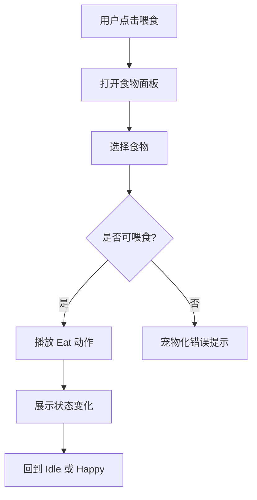

# Pet Interaction UX

## 目标

宠物交互 UX 的目标是让用户感觉自己在照顾一只有生命感的桌宠，而不是操作一组按钮。

## 设计原则

- 交互先表达情绪，再表达数据。
- 用户操作必须立即得到反馈。
- 宠物可以主动表达，但不能频繁打扰。
- 失败反馈要宠物化，但不能隐藏真实原因。
- 动作和气泡要短，避免遮挡用户工作。

## 交互对象

- 桌宠本体
- 气泡短句
- 互动面板
- 食物面板
- 清理事件
- 聊天面板
- 状态变化浮层

## 点击宠物

### 单击

行为：

- 打开互动面板。
- 宠物看向用户。
- 根据 personality 播放轻反馈。

反馈示例：

- Friendly：`你来啦！`
- Proud：`哼，终于想起我了？`
- Lazy：`再睡五分钟……`

### 连续点击

规则：

- 3 秒内点击 3 次，触发连续点击反馈。
- Friendly 倾向开心。
- Proud 倾向不满。
- Lazy 倾向困倦。

示例：

```text
Friendly：再摸摸！
Proud：别一直戳我啦。
Lazy：让我睡会儿……
```

限制：

- 连续点击反馈 10 秒内最多触发 1 次。
- 不重复增加经验，避免刷互动。

## 鼠标靠近

触发：

- 鼠标进入宠物附近热区。

行为：

- 宠物可看向鼠标。
- Curious 性格可以轻微靠近。
- Sleep 状态不响应，除非用户点击。

限制：

- 鼠标靠近不弹出大面板。
- 不频繁播放高动效。

## 拖动宠物

### 拖动开始

行为：

- 暂停自动移动。
- 宠物进入 Drag 状态。
- 可播放轻微挣扎或被抱起动作。

### 拖动中

行为：

- 跟随鼠标。
- 不触发其他动作。

### 拖动结束

行为：

- 保存窗口位置。
- 宠物落地后回到 Idle 或 Happy。

反馈：

- Friendly：`换个地方陪你。`
- Proud：`下次提前说一声。`

## 喂食流程



成功反馈：

- 食物飞向宠物或出现于宠物旁。
- 宠物播放 Eat。
- 状态浮层显示增量。
- 可触发一句短气泡。

失败反馈：

- 已吃饱：`我真的吃不下啦。`
- 网络失败：`刚刚没吃到，再试一次？`

## 铲屎流程

触发：

- 清洁度低或系统生成 cleanEvent。

展示：

- 桌面轻量清理提示。
- 不使用过度恶心或夸张视觉。

交互：

- 用户点击清理提示或互动面板中的铲屎。
- 成功后清理提示消失。
- 宠物播放 Happy 或 Relaxed。

无清理事件：

- 提示 `现在很干净。`
- 不弹错误对话框。

## 抚摸流程

触发：

- 点击互动面板抚摸。
- 后续版本可支持在宠物身上拖动模拟抚摸。

成功反馈：

- 宠物播放 Happy。
- intimacy 增加。
- mood 增加。
- 状态浮层展示变化。

频率限制：

- 高频抚摸不重复增加经验。
- Proud 性格可能轻微不满。

## 聊天流程

入口：

- 互动面板聊天按钮。
- 宠物主动气泡中的“回复”入口，Beta 后支持。

流程：

```text
打开聊天
↓
输入消息
↓
发送中
↓
宠物思考反馈
↓
返回宠物口吻回复
```

发送中反馈：

- 宠物显示思考气泡。
- 发送按钮 loading。

失败：

- 保留用户输入。
- 展示 `我刚刚走神了，再说一次好吗？`

## 主动气泡

主动气泡用于表达陪伴，不用于频繁打断。

触发场景：

- 用户长时间未互动。
- hunger 低于阈值。
- energy 低于阈值。
- 工作时间过长。
- 升级。
- 首次创建完成。

频率限制：

- 普通主动气泡 30 分钟内最多 1 次。
- 工作提醒 2 小时内最多 1 次。
- 用户关闭主动提醒后不再主动弹出。

气泡长度：

- 不超过 20 个中文字符。
- 展示时间 4 到 6 秒。

## 情绪表达

| 情绪 | 触发 | 表现 |
| --- | --- | --- |
| Happy | 喂食、抚摸、升级 | 跳跃、摇尾、开心气泡 |
| Hungry | hunger < 30 | 看向用户、短句提醒 |
| Sleepy | energy < 25 | 打哈欠、趴下 |
| Dirty | cleanliness < 40 | 清理提示 |
| Relaxed | 正常陪伴 | Idle 呼吸、眨眼 |
| Lonely | 长时间未互动 | 低频主动气泡 |

## 动作优先级

从高到低：

1. 用户正在拖动
2. 喂食 Eat
3. 抚摸 Happy
4. 清理反馈
5. 聊天思考
6. Sleep
7. Walk
8. Idle

## 低打扰规则

以下场景降低打扰：

- 全屏应用。
- 用户开启减少动画。
- 用户关闭主动提醒。
- 会议或演示模式。
- 夜间时段。

降低方式：

- 不弹主动气泡。
- 降低移动频率。
- 不播放大幅动作。
- 停靠桌面边缘。

## 异常 UX

异常不能让用户感觉宠物“坏了”。

错误文案模式：

```text
宠物化短句 + 可恢复动作
```

示例：

- 网络断开：`网络好像断开了。`
- AI 失败：`我刚刚走神了。`
- 资源失败：`我先换个样子陪你。`

## 验收标准

- 点击、拖动、喂食、铲屎、抚摸、聊天都有明确反馈。
- 主动气泡不会频繁打扰。
- 高频点击不会刷经验。
- 失败状态可恢复。
- 离线时仍能进行基础展示和有限互动。

