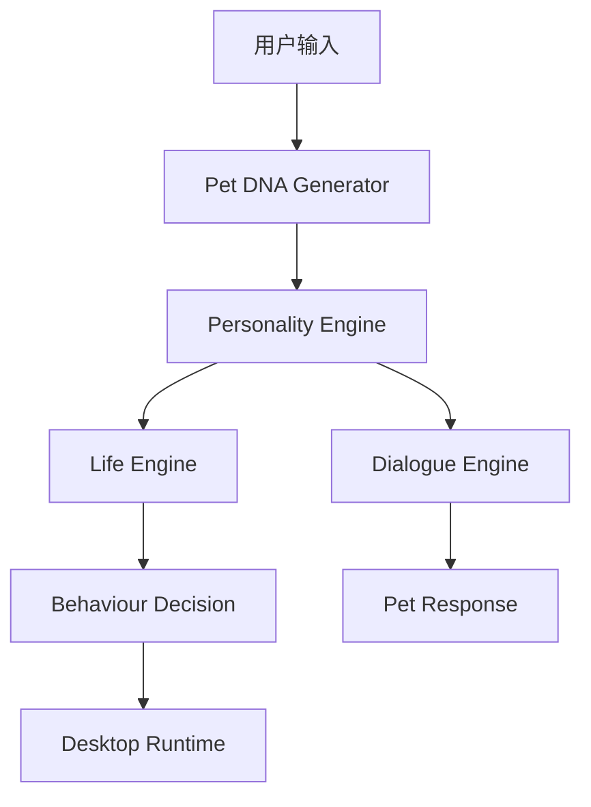

# 05 AI System Design

## AI 系统目标

AI 系统负责让宠物从静态角色变成可持续陪伴的数字生命。

MVP 阶段 AI 不追求复杂 Agent 编排，而是优先保证输出稳定、成本可控、体验闭环清晰。

## AI 能力分层

## Pet DNA Generator

输入：

- 宠物照片
- 用户填写的名称
- 用户选择的宠物类型
- 可选描述

输出：

- 物种
- 品种
- 颜色
- 体型
- 眼睛
- 耳朵
- 尾巴
- 花纹
- 性格
- 喜好
- 讨厌项
- 口头禅

## Dialogue Engine

职责：

- 根据 Pet DNA 使用宠物口吻回复用户。
- 根据宠物状态调整语气。
- 不生成危险、冒犯或过度拟人的内容。
- 对无法回答的问题保持宠物角色内的简短回应。

## Life Engine

职责：

- 根据时间流逝更新饱食度、心情、能量、清洁度。
- 根据用户互动更新亲密度和经验。
- 根据状态决定候选动作。

## Memory Engine

MVP 阶段只保存结构化记忆：

- 宠物名称
- 创建日期
- 用户常用互动
- 用户偏好的食物和动作
- 最近 20 条聊天摘要

长期版本再引入向量召回和重要度评分。

## 成本控制

- 宠物基础聊天使用低成本模型。
- Pet DNA 生成使用多模态模型，但生成后缓存结果。
- 桌宠普通行为不每分钟调用 LLM，由本地状态机决策。
- 只有高价值场景才调用 AI，例如首次生成、关键纪念日、长对话总结。

## 模型选择

- 多模态模型用于照片到 Pet DNA。
- 文本模型用于聊天、摘要、故事。
- 普通行为决策使用本地状态机。
- 所有模型必须通过 AI Gateway 封装，避免业务代码绑定具体供应商。

## Prompt 规范

Prompt 必须版本化，命名格式为 `{domain}-{scenario}-v{version}.md`。

每个 Prompt 必须包含业务目的、输入 Schema、输出 Schema、约束、示例和失败处理。

## 情绪表达

MVP 情绪集合包括 Happy、Relaxed、Hungry、Sleepy、Dirty、Lonely。

情绪由饱食度、心情、清洁度、能量、亲密度和最近互动共同决定，并通过动作、聊天气泡和状态面板表达。

## 成本分级

低成本任务包括普通聊天、短句反馈和摘要。

高成本任务包括照片识别、头像生成和动作资源生成。高成本任务必须异步化，并展示进度。
