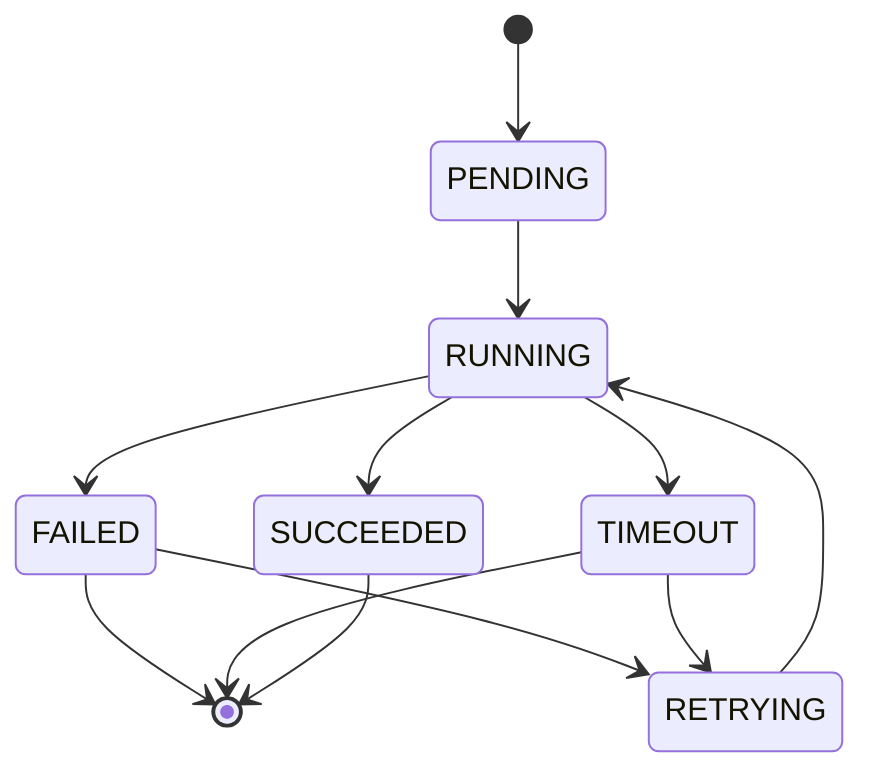

# AI Task Execution

## 目标

定义 AI 任务的创建、执行、重试、超时和失败降级策略，避免在业务请求线程和数据库事务中直接调用外部 AI 服务。

## 适用任务

MVP 包含：

- PET_DNA_GENERATION
- CHAT_REPLY
- MEMORY_SUMMARY

Beta 后增加：

- PORTRAIT_GENERATION
- SPRITE_GENERATION
- STORY_GENERATION

## 任务状态机



## 状态定义

| 状态 | 说明 |
| --- | --- |
| PENDING | 任务已创建，等待执行 |
| RUNNING | 执行中 |
| SUCCEEDED | 成功 |
| FAILED | 失败 |
| TIMEOUT | 超时 |
| RETRYING | 等待重试 |
| CANCELED | 用户取消 |

## 创建任务

业务接口只负责：

1. 校验用户权限。
2. 校验输入。
3. 创建 AiGenerationTask。
4. 提交事务。
5. 返回 taskId。

禁止：

- 在事务内调用 AI。
- 在 Controller 中拼 Prompt。
- 在接口请求线程中等待长时间生成。

## 执行任务

执行器职责：

1. 拉取 PENDING 或 RETRYING 任务。
2. 将任务标记 RUNNING。
3. 组装 Prompt 输入。
4. 调用 AI Gateway。
5. 校验输出 Schema。
6. 保存结果。
7. 标记 SUCCEEDED 或 FAILED。

## 超时策略

| 任务 | 超时 |
| --- | ---: |
| PET_DNA_GENERATION | 60 秒 |
| CHAT_REPLY | 20 秒 |
| MEMORY_SUMMARY | 30 秒 |
| PORTRAIT_GENERATION | 180 秒 |
| SPRITE_GENERATION | 600 秒 |

超时后标记 TIMEOUT，并按重试策略处理。

## 重试策略

可重试错误：

- 网络超时
- 限流
- AI 服务 5xx
- 临时解析失败

不可重试错误：

- 输入非法
- 图片不存在
- 用户无权限
- 内容安全拒绝

默认重试：

```text
第 1 次：30 秒后
第 2 次：2 分钟后
```

超过重试次数后进入 FAILED。

## 输出校验

AI 输出必须通过 Schema 校验。

PET_DNA_GENERATION 校验：

- species 合法。
- name 非空。
- confidence 范围 0 到 1。
- UNKNOWN 可接受。

CHAT_REPLY 校验：

- reply 非空。
- 不超过 80 个中文字符。
- 不包含系统 Prompt。

## 结果保存

PET_DNA_GENERATION 成功后保存为草稿或 resultPayload，不直接覆盖正式 Pet DNA。

用户确认后才写入正式 PetDna 聚合。

## 降级策略

PET_DNA_GENERATION 失败：

- 前端展示手动创建入口。

CHAT_REPLY 失败：

- 返回本地模板回复。
- 记录 AI_GENERATION_FAILED。

MEMORY_SUMMARY 失败：

- 不影响主流程。
- 下次调度继续尝试。

## 成本记录

每次 AI 调用记录：

- taskId
- taskType
- model
- inputTokens
- outputTokens
- latencyMs
- estimatedCost
- status

## 幂等

同一个 taskId 只能成功写入一次结果。

执行器抢占任务时必须使用乐观锁或状态条件更新，避免多实例重复执行。

