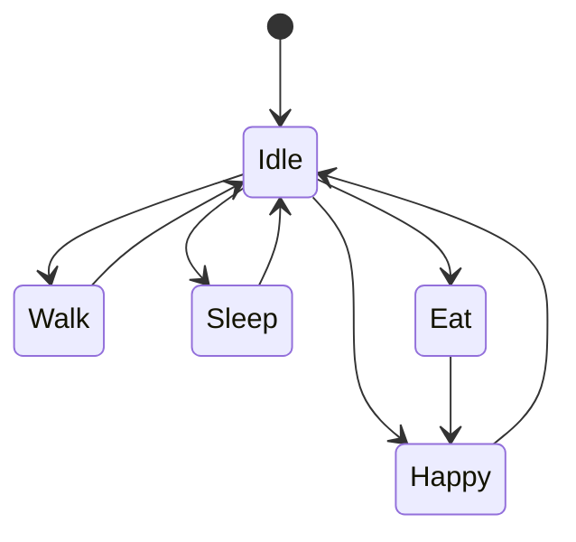

# 07 Desktop Runtime

## 技术选型

桌面端使用 Tauri 2 + React + TypeScript。

核心职责边界遵循 [Architecture-Principles.md](../00-project/Architecture-Principles.md)：

```text
React 画宠物，Rust 控窗口，Java 管大脑。
```

Rust 负责系统能力：

- 透明窗口
- 无边框窗口
- 永远置顶
- 拖动
- 鼠标穿透切换
- Windows 系统托盘
- macOS 菜单栏
- 开机启动
- 多显示器

React 负责 UI 和宠物渲染：

- 宠物状态展示
- 动画播放
- 互动面板
- 聊天面板
- 创建流程

## 运行时职责

Desktop Runtime 只负责桌面体验，不直接写复杂业务规则。

它消费以下输入：

- Pet DNA
- 当前 Pet State
- 动画资源
- 用户交互事件
- 后端或本地状态更新

它输出以下事件：

- FEED_REQUESTED
- CLEAN_REQUESTED
- PET_TOUCHED
- CHAT_MESSAGE_SENT
- PET_DRAGGED
- WINDOW_VISIBILITY_CHANGED

## 状态机



## MVP 动作

- Idle：默认待机。
- Walk：桌面随机移动。
- Sleep：低能量或夜间触发。
- Eat：喂食后触发。
- Happy：抚摸、喂食成功、聊天正反馈后触发。

## 平台支持策略

MVP 必须支持：

- Windows 桌面透明置顶。
- macOS 桌面透明置顶。
- 宠物可拖动。
- 用户可隐藏或显示宠物。
- Windows 托盘菜单可退出应用。
- macOS 菜单栏入口可退出应用。

平台差异：

| 能力 | Windows | macOS | MVP 策略 |
| --- | --- | --- | --- |
| 透明无边框窗口 | 支持 | 支持 | 必须实现 |
| 永远置顶 | 支持 | 支持，但需处理 Space/全屏应用差异 | 必须实现普通桌面场景 |
| 恢复入口 | 系统托盘 | 菜单栏状态项 | 必须提供显示、隐藏、退出 |
| 鼠标穿透 | 可实现 | 可实现，但权限和窗口层级更敏感 | MVP 可选，不阻塞主流程 |
| 开机启动 | 启动项 | Login Items | MVP 不做 |
| 打包 | msi/nsis | dmg/app | Beta 验收必须覆盖 |

## macOS 行为

MVP 支持：

- 透明无边框窗口。
- 基础置顶。
- 拖动宠物。
- 菜单栏显示、隐藏和退出。
- 本地保存窗口位置。

限制：

- 不承诺覆盖所有全屏 Space。
- 不默认申请辅助功能权限。
- 不在 MVP 中做 Dock 图标隐藏策略的精细化配置。

后续支持：

- 应用识别。
- 全屏游戏自动隐藏。
- 会议模式安静。
- 下载完成提醒。
- VS Code、浏览器、音乐播放器场景互动。

## 输入

输入来源包括鼠标点击、鼠标拖动、右键菜单、键盘输入和托盘菜单。

聊天输入只在聊天面板聚焦时捕获键盘，不能影响用户其他应用。

## 托盘

MVP 托盘菜单包括显示宠物、隐藏宠物、设置和退出。退出前必须保存宠物状态和窗口位置。

## 性能

桌宠需要长期常驻：

- 常驻内存目标低于 200 MB。
- Idle 状态 CPU 占用尽量接近 0。
- 动画资源预加载。
- 不在渲染阶段发起网络请求。
