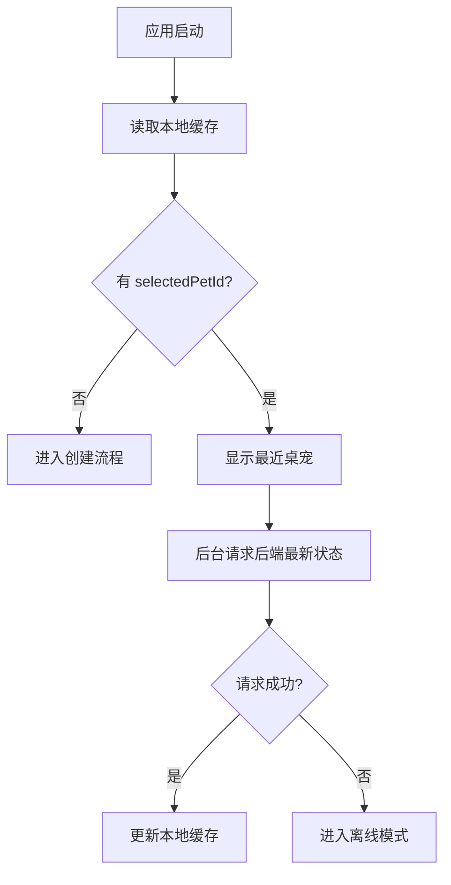

# Local Cache And Sync

## 目标

定义桌面端本地缓存与后端同步策略，保证桌宠可常驻、可恢复，并在网络异常时保持基础体验。

## 本地缓存内容

MVP 缓存：

```json
{
  "selectedPetId": "pet_001",
  "lastKnownPet": {},
  "lastKnownPetDna": {},
  "lastKnownPetState": {},
  "windowPosition": {
    "x": 1200,
    "y": 700
  },
  "settings": {
    "isPetVisible": true,
    "reduceMotion": false,
    "activeReminder": true,
    "launchOnStartup": false
  },
  "pendingEvents": []
}
```

## 存储方式

MVP 使用 Tauri app data 目录下的 JSON 文件。

后续可迁移到 SQLite。

## 启动流程



## 退出流程

退出前必须保存：

- selectedPetId
- windowPosition
- settings
- lastKnownPetState
- pendingEvents

## 在线模式

在线时：

- 喂食、铲屎、抚摸直接调用后端。
- 成功后以后端返回状态为准。
- 本地缓存更新为最新状态。

## 离线模式

离线允许：

- 显示桌宠。
- 播放本地动画。
- 打开状态面板。
- 使用最近状态。
- 本地抚摸反馈。

离线禁止：

- 照片上传。
- Pet DNA 生成。
- AI 聊天。
- 喂食提交。
- 铲屎提交。

## pendingEvents

MVP 只允许 TOUCH_CLICKED 进入 pendingEvents。

事件格式：

```json
{
  "eventId": "local_evt_001",
  "petId": "pet_001",
  "type": "TOUCH_CLICKED",
  "payload": {
    "touchType": "HEAD"
  },
  "createdAt": "2026-06-28T10:00:00Z",
  "syncStatus": "PENDING"
}
```

## 同步策略

网络恢复后：

1. 拉取后端最新 Pet State。
2. 顺序提交 pendingEvents。
3. 每个事件成功后标记 SYNCED。
4. 任一事件失败，保留并展示轻量提示。
5. 最后再次拉取 Pet State。

## 冲突策略

以后端状态为准。

本地状态只用于展示，不作为最终状态覆盖后端。

如果 pendingEvents 超过 24 小时未同步，自动丢弃，并写入本地日志。

## 缓存版本

缓存文件必须包含 schemaVersion。

示例：

```json
{
  "schemaVersion": 1,
  "data": {}
}
```

当 schemaVersion 不兼容时：

- 尝试迁移。
- 迁移失败则清空缓存并进入创建或登录流程。

## 隐私

本地缓存不保存：

- API Token 明文。
- 带签名的对象存储 URL。
- 完整 AI Prompt。

宠物照片只缓存本地可控副本路径或对象存储 key。

## 验收标准

- 断网后重启应用仍能显示最近宠物。
- 退出后再次打开能恢复窗口位置。
- 离线时聊天入口展示不可用提示。
- 网络恢复后 pending touch 事件可同步。
- 缓存损坏时应用不会白屏。

