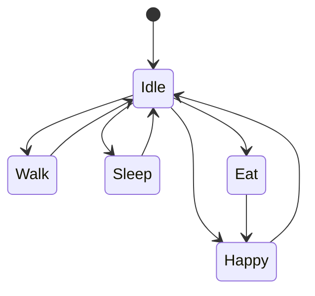

# State Machine

## 状态集合

MVP 状态：

- Idle
- Walk
- Sleep
- Eat
- Happy

## 状态输入

- 当前 Pet State
- 用户互动
- 时间段
- 动画播放完成事件

## 转换原则

- 用户触发优先级高于随机行为。
- Sleep 不应频繁打断。
- Eat 必须由喂食触发。
- Happy 是短暂反馈状态。

## 状态图

