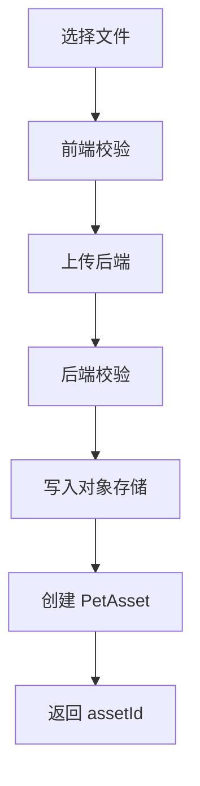

# Asset Pipeline

## 目标

定义宠物照片、AI 生成资源、预置 Sprite 和桌面运行时资源的流转方式。

## 资源类型

| 类型 | 说明 | MVP |
| --- | --- | --- |
| ORIGINAL_PHOTO | 用户上传原图 | 是 |
| PORTRAIT | AI 生成头像 | 否 |
| ILLUSTRATION | AI 生成立绘 | 否 |
| SPRITE_SHEET | 动作图集 | 是，预置 |
| ANIMATION_META | 动画元数据 | 是，预置 |
| PET_CARD | 宠物名片 | 否 |

## 资源状态

```text
UPLOADING
READY
FAILED
DELETED
```

## 原图上传流程



## 预置 Sprite 管理

预置 Sprite 存放在桌面端资源目录或 CDN。

每组 Sprite 包含：

- sprite sheet
- animation json
- preview image
- manifest

manifest 示例：

```json
{
  "spriteCode": "cat-proud-orange",
  "species": "CAT",
  "personality": "Proud",
  "primaryColor": "Orange",
  "actions": ["Idle", "Walk", "Sleep", "Eat", "Happy"],
  "fallback": "cat-default"
}
```

## 动画元数据

```json
{
  "actionCode": "Idle",
  "frameCount": 12,
  "fps": 8,
  "loop": true,
  "width": 256,
  "height": 256,
  "anchor": {
    "x": 128,
    "y": 220
  }
}
```

## 桌面端加载策略

- 启动时加载 selectedPetId。
- 查询 Pet DNA 和 Pet State。
- 根据 Sprite 匹配规则选择资源。
- 预加载 Idle、Walk、Happy。
- Eat、Sleep 可按需加载。

## 删除策略

用户删除宠物时：

- pet 标记为 DELETED。
- asset 标记为 DELETED。
- 对象存储资源进入待清理队列。
- 不在用户请求线程中删除对象存储文件。

## 安全策略

- 原图访问必须使用临时签名。
- 日志不能打印带签名 URL。
- AI 调用只传递必要图片引用。

## 失败重试

上传失败：

- 用户手动重试。

AI 生成资源失败：

- 任务可自动重试 2 次。
- 仍失败则允许用户使用默认资源。

桌面端资源加载失败：

- 回退 default pet。
- 写入本地日志。

