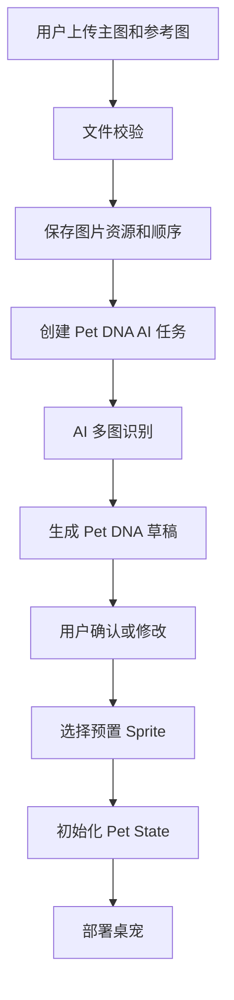

# Image To Pet Pipeline

## 目标

定义用户上传宠物照片后，系统如何生成可运行桌宠。MVP 阶段不承诺直接从照片生成完整可动 Sprite，而是先完成稳定闭环：

```text
主图 + 参考图 -> Pet DNA -> 预置 Sprite -> 可互动桌宠
```

## 分阶段策略

### MVP：照片生成 Pet DNA

MVP 生成目标：

- 宠物类型
- 外观特征
- 性格建议
- 喜好和讨厌项
- 口头禅

桌宠资源使用预置 Sprite 模板。

### Beta：照片生成头像和立绘

Beta 生成目标：

- 宠物头像
- 宠物展示立绘
- 个性化卡片

动作仍可使用预置 Sprite。

### V1：照片生成一致性 Sprite

V1 生成目标：

- 正面、侧面、背面参考图
- Idle、Walk、Sleep、Eat、Happy 动作关键帧
- Sprite Sheet
- Animation JSON

该阶段必须加入一致性校验和失败回退。

## MVP 主流程



## 文件校验

校验项：

- 文件类型：JPG、PNG、WebP。
- 单文件大小：不超过 10 MB。
- 单次创建流程最多 1 张主图 + 4 张参考图。
- 批次总大小不超过 30 MB。
- 图片可解码。
- 图片宽高不为 0。
- 主图不能为空。

失败时不能创建 AI 任务。

## AI 识别输入

输入包括：

- 主图 URL 或对象存储 key。
- 参考图 URL 或对象存储 key 列表。
- 图片角色：PRIMARY、FRONT、SIDE、BACK、DETAIL、OTHER。
- 用户填写名称。
- 用户选择的 speciesHint。
- 用户描述。

## 多图融合规则

- 主图权重最高，决定默认头像、预览图和主要外观判断。
- 参考图用于补充主图看不清的体型、尾巴、背部、花纹和局部特征。
- AI 输出需要包含 confidence 和 evidenceSummary，说明主要判断来自哪些图片。
- 多图出现明显冲突时，AI 不直接失败，而是输出 mismatchWarning 和低置信度字段。
- 用户可以删除有问题的参考图后重新生成。

## AI 识别输出

输出必须符合 [PetDNA-Schema.md](../04-ai-core/PetDNA-Schema.md)。

AI 不确定字段必须返回 UNKNOWN。

## 用户确认

AI 生成结果必须经过用户确认。

允许用户修改：

- 名称
- 类型
- 品种
- 颜色
- 性格
- 喜欢的食物
- 讨厌项
- 口头禅

## Sprite 匹配规则

MVP 使用规则匹配：

```text
species + personality.primary + appearance.primaryColor
```

匹配顺序：

1. species + personality + color
2. species + personality
3. species
4. default pet

示例：

```text
CAT + Proud + Orange -> cat-proud-orange
CAT + Proud -> cat-proud-default
CAT -> cat-default
```

## 失败回退

### AI 失败

用户进入手动 Pet DNA 创建。

### Sprite 匹配失败

使用 species 默认 Sprite。

### 资源加载失败

使用 default pet Sprite，并记录日志。

## 用户文案原则

对用户表达：

```text
AI 正在识别你的宠物，生成它的数字身份。
```

避免承诺：

```text
AI 将立刻生成完全像照片的可动桌宠。
```

## 验收标准

- 上传 1 张合法主图后可以生成 Pet DNA 草稿。
- 上传主图 + 参考图后，Pet DNA 草稿包含多图识别置信度和证据摘要。
- 上传超过 5 张图片时前端阻止提交，后端返回明确错误码。
- AI 失败时仍可手动创建。
- 确认 Pet DNA 后可以部署桌宠。
- 没有专属 Sprite 时可以回退默认 Sprite。
