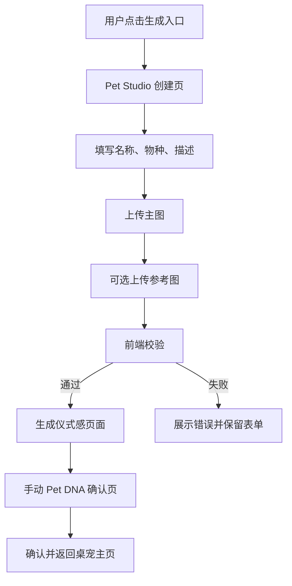

# Sprint 4 Plan: Pet Studio MVP

## Summary

Sprint 4 目标是把当前禁用的 Pet Studio 入口推进为可用的前端创建流程。

本 Sprint 不接 AI、不做真实对象存储、不新增后端接口，先完成稳定的本地体验闭环：

```text
进入 Pet Studio -> 填写基础信息 -> 上传主图和参考图 -> 本地校验 -> 生成仪式感页面 -> 手动 Pet DNA 确认 -> 返回桌宠主页
```

Sprint 5 再接真实图片上传接口、AI Pet DNA 任务和后端持久化。

## Goals

- 用户可以从桌宠主页进入 Pet Studio。
- 用户可以填写宠物名称、物种、描述。
- 用户必须选择 1 张主图，可选最多 4 张参考图。
- 前端完成文件类型、大小、数量和总大小校验。
- 用户可以给参考图标记角色：FRONT、SIDE、BACK、DETAIL、OTHER。
- 没接 AI 时，仍可进入手动 Pet DNA 确认页。
- 确认后回到桌宠主页，当前默认桌宠仍可继续使用。

## Non Goals

- 不上传到后端。
- 不创建 assetId。
- 不创建 AI 任务。
- 不保存正式 Pet DNA 版本。
- 不生成真实 Sprite。
- 不替换当前默认 Momo Pet 运行时资产。
- 不改 Spring Boot 后端。

## User Flow



## Frontend Scope

新增 `apps/desktop/src/features/pet-studio`：

```text
pet-studio/
├── components/
│   ├── PetStudioEntry.tsx
│   ├── PhotoUploadPanel.tsx
│   ├── PhotoRoleSelector.tsx
│   ├── GenerationRitual.tsx
│   └── PetDnaManualForm.tsx
├── hooks/
│   └── use-pet-studio-draft.ts
├── types.ts
└── validation.ts
```

### Screen States

- `input`：基础信息 + 图片选择。
- `ritual`：本地生成仪式感，展示“正在整理它的数字身份”。
- `confirm`：Pet DNA 手动确认。
- `done`：确认完成后返回主页。

### Photo Rules

- 主图必填。
- 参考图最多 4 张。
- 单文件不超过 10 MB。
- 批次总大小不超过 30 MB。
- 支持 JPG、PNG、WebP。
- 图片需要能被浏览器解码。
- 不能因为某张图片失败导致页面白屏。

### Pet DNA Manual Fields

参考 [PetDNA-Schema.md](../04-ai-core/PetDNA-Schema.md)，Sprint 4 只做前端草稿字段：

- name
- species
- breed
- primaryColor
- pattern
- eyeColor
- primary personality
- energyLevel
- favoriteFoods
- dislikedThings
- catchphrases

## Integration

- `ActionDock` 中的“生成”按钮从 disabled 改为可点击。
- 点击后在主页内切换到 Pet Studio 视图，暂不新开窗口。
- Pet Studio 完成或取消后返回当前 `DesktopScene`。
- 不影响 `feed/touch/clean` 已有养成闭环。

## Error UX

- 图片数量超限：`最多上传 1 张主图和 4 张参考图。`
- 单文件过大：`单张图片不能超过 10 MB。`
- 总大小超限：`本次图片总大小不能超过 30 MB。`
- 格式不支持：`只支持 JPG、PNG 或 WebP。`
- 解码失败：`这张图片无法读取，请换一张更清晰的。`

## Test Plan

- `pnpm --filter @momo/desktop lint`
- `pnpm --filter @momo/desktop build`
- `pnpm format:check`
- 浏览器手测：
  - 不上传主图不能继续。
  - 上传 1 张主图可以进入确认页。
  - 上传 4 张参考图可以继续。
  - 上传第 5 张参考图被阻止。
  - 非图片文件被阻止。
  - 超大图片被阻止。
  - 取消后返回桌宠主页。
  - 确认后返回桌宠主页，不破坏当前默认宠物状态。

## Acceptance Criteria

- Pet Studio 入口可用。
- 上传和校验体验完整。
- 生成仪式感页面存在，但不承诺真实 AI 输出。
- 手动 Pet DNA 表单可编辑并完成本地确认。
- 桌宠主页和桌宠窗口不回归。
