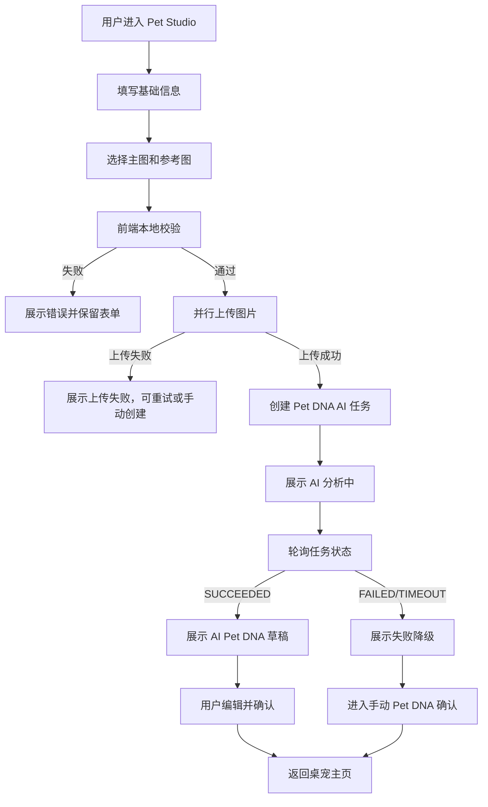

# Sprint 5 Plan: AI Pet DNA Task

## Summary

Sprint 5 目标是把 Sprint 4 的本地 Pet Studio 流程接入真实后端任务链路：

```text
上传主图和参考图 -> 保存 asset 元数据 -> 创建 AI Pet DNA 任务 -> 查询任务状态 -> 返回 Pet DNA 草稿 -> 用户确认或手动降级
```

本 Sprint 仍不承诺从照片生成完整可动 Sprite，也不进入聊天、后台管理和付费能力。重点是建立稳定的异步 AI 任务基础设施，让 Pet Studio 可以从“前端本地演示”升级为“可持久化、可重试、可失败降级”的产品闭环。

## Goals

- Pet Studio 可以把 1 张主图和最多 4 张参考图上传到后端。
- 后端保存图片 asset 元数据和本地文件存储 key。
- 后端创建 `PET_DNA_GENERATION` 任务，并返回 `taskId`。
- 前端可以轮询任务状态，展示分析中、成功、失败和超时。
- AI 成功后返回符合 `PetDNA-Schema.md` 的 Pet DNA 草稿。
- AI 失败、超时或输出校验失败时，用户仍可进入手动 Pet DNA 确认页。
- 后端 DDD 分层清晰，事务内不调用 AI 或远程服务。

## Non Goals

- 不生成真实 Sprite、动画帧、立绘或头像。
- 不替换当前默认 Momo Pet 运行时资产。
- 不接聊天能力。
- 不做后台 AI Tasks 管理页。
- 不接对象存储云服务，Sprint 5 使用后端本地文件存储适配器。
- 不做登录和真实多用户权限，继续使用固定 `ownerId = local-user`。
- 不在接口请求线程内等待 AI 完成。
- 不把 AI 草稿直接覆盖为正式 Pet DNA，必须经过用户确认。

## User Flow



## Backend Scope

### Bounded Contexts

Sprint 5 新增或补齐以下限界上下文：

| Context | 职责                                            |
| ------- | ----------------------------------------------- |
| `asset` | 保存用户上传照片的元数据、角色、存储 key 和状态 |
| `ai`    | 创建、执行、查询 AI 生成任务                    |
| `pet`   | 保存 Pet DNA 草稿和用户确认后的正式版本         |

已有 `pet` 上下文继续负责宠物档案和 Pet State。`asset` 和 `ai` 不应把业务逻辑写进 `pet` Controller。

### Package Structure

```text
com.company.momo.asset
├── application
├── domain
├── infrastructure
└── interfaces

com.company.momo.ai
├── application
├── domain
├── infrastructure
└── interfaces

com.company.momo.pet
├── application
├── domain
├── infrastructure
└── interfaces
```

### Domain Model

#### asset context

聚合和值对象：

- `Asset`
  - `assetId`
  - `petId`
  - `ownerId`
  - `assetType`
  - `photoRole`
  - `storageKey`
  - `originalFilename`
  - `contentType`
  - `sizeBytes`
  - `status`
  - `createdAt`
- `AssetId`
- `StorageKey`
- `PhotoRole`
- `AssetType`
- `AssetStatus`

业务规则：

- Sprint 5 只允许 `ORIGINAL_PHOTO`。
- `photoRole` 必须是 `PRIMARY / FRONT / SIDE / BACK / DETAIL / OTHER`。
- 单文件不超过 10 MB。
- 支持 `image/jpeg / image/png / image/webp`。
- 上传接口不创建 AI 任务。
- 删除暂不开放；失败文件可以标记 `FAILED`。

Repository：

- `AssetRepository`
  - `save(Asset asset)`
  - `findReadyOriginalPhotoByAssetId(AssetId assetId)`
  - `findReadyOriginalPhotosByAssetIds(Collection<AssetId> assetIds)`

Infrastructure：

- `LocalAssetStorage`
  - 保存到 `apps/backend/data/uploads` 或配置项 `momo.storage.local-root`。
  - 返回相对 `storageKey`，数据库不保存绝对路径。
  - 文件名使用 `assetId + extension`，避免原始文件名冲突。

#### ai context

聚合和值对象：

- `AiGenerationTask`
  - `taskId`
  - `petId`
  - `ownerId`
  - `taskType`
  - `status`
  - `requestPayload`
  - `resultPayload`
  - `errorCode`
  - `retryCount`
  - `nextRetryAt`
  - `startedAt`
  - `completedAt`
  - `createdAt`
  - `updatedAt`
  - `version`
- `AiTaskId`
- `AiTaskStatus`
- `AiTaskType`
- `AiTaskErrorCode`

业务规则：

- Sprint 5 只实现 `PET_DNA_GENERATION`。
- 创建任务时状态为 `PENDING`。
- 任务执行状态流转：`PENDING -> RUNNING -> SUCCEEDED / FAILED / TIMEOUT`。
- 可重试错误后续 Sprint 再实现自动重试；Sprint 5 可先记录 `retryCount = 0`。
- 执行器抢占任务时必须使用状态条件更新或乐观锁，避免重复执行。
- `resultPayload` 保存 AI 生成的 Pet DNA 草稿 JSON，不直接覆盖正式 Pet DNA。

Repository：

- `AiGenerationTaskRepository`
  - `save(AiGenerationTask task)`
  - `findByTaskId(AiTaskId taskId)`
  - `findPendingTasks(int limit)`
  - `markRunning(AiTaskId taskId, Instant startedAt)`
  - `saveResult(AiTaskId taskId, String resultPayload)`
  - `saveFailure(AiTaskId taskId, AiTaskErrorCode errorCode)`

Infrastructure：

- `PetDnaAiGateway`
  - Adapter 封装外部 AI 或 Sprint 5 的本地模拟 AI。
  - 业务层只依赖接口，不依赖具体模型 SDK。
- `PetDnaPromptAssembler`
  - 组装结构化 Prompt 输入。
  - 不在 Controller 中拼 Prompt。
- `AiTaskScheduler`
  - 使用 Spring `@Scheduled` 拉取 `PENDING` 任务。
  - 事务内只改状态和写结果；AI 调用必须在事务外执行。

#### pet context

新增 Pet DNA 草稿和确认能力：

- `PetDna`
  - 正式 Pet DNA 版本。
- `PetDnaDraft`
  - AI 或手动生成的可编辑草稿。

Sprint 5 最小实现可以先把 AI 草稿放在 `AiGenerationTask.resultPayload`，前端确认时通过 `PUT /api/pets/{petId}/dna` 保存正式版本。若实现复杂度可控，则单独落 `pet_dna_draft` 表，便于审计和重试。

## Database Design

Sprint 5 使用 H2 文件库，表结构按未来 PostgreSQL 迁移设计。

### asset

```sql
create table asset (
  asset_id varchar(64) primary key,
  pet_id varchar(64) not null,
  owner_id varchar(64) not null,
  asset_type varchar(32) not null,
  photo_role varchar(32) not null,
  storage_key varchar(255) not null,
  original_filename varchar(255) not null,
  content_type varchar(100) not null,
  size_bytes bigint not null,
  status varchar(32) not null,
  created_at timestamp not null,
  updated_at timestamp not null
);

create index idx_asset_pet_id on asset (pet_id);
create index idx_asset_owner_id on asset (owner_id);
```

### ai_generation_task

```sql
create table ai_generation_task (
  task_id varchar(64) primary key,
  pet_id varchar(64) not null,
  owner_id varchar(64) not null,
  task_type varchar(64) not null,
  status varchar(32) not null,
  request_payload clob not null,
  result_payload clob,
  error_code varchar(64),
  retry_count int not null,
  next_retry_at timestamp,
  started_at timestamp,
  completed_at timestamp,
  created_at timestamp not null,
  updated_at timestamp not null,
  version bigint not null
);

create index idx_ai_task_status_created_at on ai_generation_task (status, created_at);
create index idx_ai_task_pet_id on ai_generation_task (pet_id);
```

### pet_dna

```sql
create table pet_dna (
  pet_dna_id varchar(64) primary key,
  pet_id varchar(64) not null,
  version int not null,
  source varchar(32) not null,
  dna_payload clob not null,
  created_at timestamp not null,
  confirmed_at timestamp not null
);

create unique index uk_pet_dna_pet_version on pet_dna (pet_id, version);
create index idx_pet_dna_pet_id on pet_dna (pet_id);
```

## API Contract

全部接口返回 `ApiResponse<T>`。

### POST /api/pets/{petId}/photos

上传单张宠物照片。前端多图时可以并行上传，但后端仍按单图处理。

Request：

- `multipart/form-data`
- `file`: JPG、PNG、WebP
- `photoRole`: `PRIMARY / FRONT / SIDE / BACK / DETAIL / OTHER`

Response data：

```json
{
  "assetId": "asset_001",
  "assetType": "ORIGINAL_PHOTO",
  "photoRole": "PRIMARY",
  "status": "READY",
  "contentType": "image/png",
  "sizeBytes": 123456
}
```

### POST /api/pets/{petId}/dna/generation-tasks

创建 Pet DNA AI 任务。

Request：

```json
{
  "name": "Momo Pet",
  "speciesHint": "CAT",
  "primaryPhotoAssetId": "asset_001",
  "referencePhotoAssetIds": ["asset_002", "asset_003"],
  "userDescription": "橘白长毛，比较亲人"
}
```

Response data：

```json
{
  "taskId": "task_001",
  "status": "PENDING"
}
```

后端校验：

- `petId` 存在且属于 `local-user`。
- `primaryPhotoAssetId` 必填，且属于当前 `petId`。
- 参考图最多 4 张。
- 所有 `assetId` 必须是 `READY` 状态。
- 所有 `assetId` 必须属于同一个 `petId`。
- 主图 asset 的 `photoRole` 必须是 `PRIMARY`。

### GET /api/ai/tasks/{taskId}

查询 AI 任务状态。

Response data：

```json
{
  "taskId": "task_001",
  "petId": "pet_001",
  "taskType": "PET_DNA_GENERATION",
  "status": "SUCCEEDED",
  "result": {
    "petDnaDraft": {
      "name": "Momo Pet",
      "species": "CAT",
      "breed": "UNKNOWN",
      "appearance": {
        "primaryColor": "Orange",
        "secondaryColor": "White",
        "pattern": "Tabby",
        "eyeColor": "Amber"
      },
      "personality": {
        "primary": "Friendly",
        "energyLevel": "MEDIUM"
      },
      "preferences": {
        "favoriteFoods": ["DRIED_FISH"],
        "dislikedThings": ["BATH"]
      },
      "voice": {
        "catchphrases": ["摸摸头会更舒服"]
      },
      "generation": {
        "source": "AI",
        "confidence": 0.78,
        "model": "pet-dna-mock-v1",
        "generatedAt": "2026-06-30T10:00:00Z",
        "evidenceSummary": "主图显示橘白长毛，参考图补充了尾巴和背部花纹。",
        "mismatchWarning": null
      }
    }
  },
  "errorCode": null
}
```

失败 Response data：

```json
{
  "taskId": "task_001",
  "petId": "pet_001",
  "taskType": "PET_DNA_GENERATION",
  "status": "FAILED",
  "result": null,
  "errorCode": "AI_GENERATION_FAILED"
}
```

### PUT /api/pets/{petId}/dna

用户确认或修订 Pet DNA。

Request：

```json
{
  "source": "AI",
  "name": "Momo Pet",
  "species": "CAT",
  "breed": "UNKNOWN",
  "appearance": {
    "primaryColor": "Orange",
    "secondaryColor": "White",
    "pattern": "Tabby",
    "eyeColor": "Amber"
  },
  "personality": {
    "primary": "Friendly",
    "energyLevel": "MEDIUM"
  },
  "preferences": {
    "favoriteFoods": ["DRIED_FISH"],
    "dislikedThings": ["BATH"]
  },
  "voice": {
    "catchphrases": ["摸摸头会更舒服"]
  }
}
```

Response data：

```json
{
  "petId": "pet_001",
  "version": 1
}
```

## Error Codes

新增或补齐错误码：

| Code                             | 场景                         |
| -------------------------------- | ---------------------------- |
| `ASSET_TYPE_UNSUPPORTED`         | 上传文件格式不支持           |
| `ASSET_TOO_LARGE`                | 单文件超过 10 MB             |
| `ASSET_UPLOAD_FAILED`            | 文件写入失败                 |
| `ASSET_NOT_FOUND`                | assetId 不存在               |
| `ASSET_NOT_READY`                | asset 状态不是 READY         |
| `ASSET_OWNER_MISMATCH`           | asset 不属于当前宠物或用户   |
| `PRIMARY_PHOTO_REQUIRED`         | 创建任务时缺少主图           |
| `REFERENCE_PHOTO_LIMIT_EXCEEDED` | 参考图超过 4 张              |
| `AI_TASK_NOT_FOUND`              | 查询不存在的任务             |
| `AI_TASK_TYPE_UNSUPPORTED`       | 不支持的 AI 任务类型         |
| `AI_GENERATION_FAILED`           | AI 生成失败                  |
| `AI_GENERATION_TIMEOUT`          | AI 生成超时                  |
| `AI_RESULT_INVALID`              | AI 输出不符合 Pet DNA Schema |
| `PET_DNA_INVALID`                | 用户确认的 Pet DNA 不合法    |

## AI Execution Strategy

### Sprint 5 Recommended Path

Sprint 5 可以先使用 `MockPetDnaAiGateway` 完成异步任务闭环：

- 不调用真实外部模型。
- 根据 `speciesHint`、图片角色和描述生成稳定 Pet DNA 草稿。
- 支持通过配置或测试开关模拟 `FAILED / TIMEOUT / AI_RESULT_INVALID`。
- 保留 `PetDnaAiGateway` 接口，Sprint 5.5 或 Sprint 6 再替换真实多模态模型 Adapter。

这样可以先验证上传、任务、轮询、草稿、确认和失败降级，不让模型接入风险卡住产品主链路。

### Real AI Gateway Boundary

真实 AI 接入时必须满足：

- 超时：`PET_DNA_GENERATION` 最多 60 秒。
- 输出必须是结构化 JSON。
- 入库前必须校验 `PetDNA-Schema.md`。
- 不确定字段使用 `UNKNOWN`。
- 不允许把模型原始长文本直接返回前端。
- 记录模型名、耗时、状态和估算成本。

## Frontend Scope

### State Machine

Pet Studio 从 Sprint 4 的三步状态升级为：

```text
input
uploading
task-created
analyzing
ai-success
ai-failed
confirm
done
```

状态说明：

| State          | UI 行为                                        |
| -------------- | ---------------------------------------------- |
| `input`        | 基础信息和图片选择                             |
| `uploading`    | 上传图片，按钮禁用，展示上传进度或图片数量进度 |
| `task-created` | 已拿到 taskId，准备轮询                        |
| `analyzing`    | 展示 AI 分析中，不承诺生成可动 Sprite          |
| `ai-success`   | 将 AI 草稿填入 Pet DNA 确认页                  |
| `ai-failed`    | 展示失败原因和手动创建入口                     |
| `confirm`      | 用户编辑并确认 Pet DNA                         |
| `done`         | 返回桌宠主页                                   |

### API Layer

新增 `apps/desktop/src/features/pet-studio/api/pet-studio-api.ts`：

- `uploadPetPhoto(petId, file, photoRole)`
- `createPetDnaGenerationTask(petId, request)`
- `getAiTask(taskId)`
- `confirmPetDna(petId, request)`

所有 API 继续返回并解析 `ApiResponse<T>`，业务组件不直接写 `fetch`。

### Polling Rules

- 默认每 1.5 秒轮询一次。
- 最长轮询 60 秒。
- 页面关闭或用户取消时停止轮询。
- `SUCCEEDED / FAILED / TIMEOUT / CANCELED` 后停止轮询。
- 网络失败时展示可重试状态，不白屏。

### Error UX

上传失败：

```text
照片上传失败了，可以重试，也可以先手动创建。
```

AI 失败：

```text
我没能看清它的样子，你可以先手动填写，之后再重新生成。
```

AI 超时：

```text
分析时间有点久，我们先用手动草稿继续。
```

多图不一致：

```text
有些参考图可能不是同一只宠物，请检查后再确认。
```

## Performance And Reliability

- 多图上传前端可并行，但最多 5 个请求。
- 后端保存 asset 时不读取完整文件到内存；使用流式写入。
- 创建任务时批量查询 asset，避免在循环内逐个查库。
- 查询任务使用 `taskId` 主键，不做大列表扫描。
- AI 任务执行器每次拉取有限数量任务，例如 5 条。
- 任务状态更新使用乐观锁或条件更新，避免并发重复执行。
- 本地文件存储路径不得使用用户原始文件名直接拼接。

## Logging

后端业务日志格式：

- 上传成功：`【照片上传】【petId={} assetId={}】【role={} sizeBytes={} status=READY】`
- 上传失败：`【照片上传失败】【petId={} filename={}】【reason={}]`
- 创建任务：`【AI任务创建】【taskId={} petId={}】【type=PET_DNA_GENERATION status=PENDING】`
- 状态变化：`【AI任务状态变化】【taskId={}】【from={} to={}】`
- AI 失败：`【AI任务失败】【taskId={} petId={}】【errorCode={}]`
- Pet DNA 确认：`【PetDNA确认】【petId={} version={}】【source={}]`

禁止打印完整图片内容、完整 Prompt、完整用户上传文件、敏感路径和超大 JSON。

## Implementation Order

1. `asset` 上下文：领域模型、Repository、JPA、上传接口、本地存储。
2. `ai` 上下文：任务领域模型、Repository、任务创建接口、任务查询接口。
3. `MockPetDnaAiGateway` 和异步任务执行器。
4. `pet` 上下文补 Pet DNA 确认接口和版本化保存。
5. `packages/shared` 补充 Asset、AiTask、PetDna 类型。
6. Desktop Pet Studio API 层接入上传、创建任务、轮询。
7. Pet Studio UI 接入 AI 成功草稿和失败手动降级。
8. 补测试和验收文档。

## Test Plan

后端领域测试：

- `Asset.createOriginalPhoto` 校验格式、大小、角色。
- 创建 Pet DNA 任务时必须有主图。
- 参考图超过 4 张时失败。
- 跨 petId 的 asset 不能创建任务。
- AI 任务状态只能合法流转。
- AI 输出不符合 Schema 时任务进入 `FAILED`。
- Pet DNA 确认后 version 从 1 开始递增。

后端接口测试：

- `POST /api/pets/{petId}/photos` 上传合法图片返回 assetId。
- 非支持格式返回 `ASSET_TYPE_UNSUPPORTED`。
- 超大文件返回 `ASSET_TOO_LARGE`。
- `POST /api/pets/{petId}/dna/generation-tasks` 成功返回 taskId。
- 不存在 petId 返回 `PET_NOT_FOUND`。
- 不存在 assetId 返回 `ASSET_NOT_FOUND`。
- `GET /api/ai/tasks/{taskId}` 返回 PENDING/RUNNING/SUCCEEDED/FAILED。
- `PUT /api/pets/{petId}/dna` 保存正式 Pet DNA。

前端验证：

- `pnpm --filter @momo/desktop lint`
- `pnpm --filter @momo/desktop build`
- `pnpm build:packages`
- `pnpm format:check`
- 上传中按钮禁用，不重复提交。
- 任务成功后进入 Pet DNA 确认页。
- 任务失败后可以手动确认。
- 取消或关闭 Pet Studio 后停止轮询。

回归验证：

- `cd apps/backend && mvn test`
- 桌宠主页喂食、抚摸、清理仍可用。
- Sprint 2 桌面窗口能力不回归。

## Acceptance Criteria

- 上传 1 张合法主图后可以创建 AI Pet DNA 任务。
- 上传主图 + 参考图后，任务 requestPayload 记录完整 asset 引用和 photoRole。
- 任务成功后前端展示 AI Pet DNA 草稿，并允许编辑。
- 任务失败或超时后前端可进入手动 Pet DNA 确认页。
- 用户确认后后端保存 Pet DNA version。
- 所有新增接口返回统一 `ApiResponse<T>`。
- 后端没有在 Controller 或事务内直接调用 AI。
- 没有新增真实 Sprite 生成、聊天、后台等越界功能。

## Assumptions

- Sprint 5 使用 H2 文件库。
- Sprint 5 使用本地文件存储。
- Sprint 5 优先使用 Mock AI Gateway 打通异步任务闭环。
- 默认用户身份仍为 `local-user`。
- 默认宠物仍为当前 `Momo Pet`，Pet DNA 确认后是否替换运行时资产留到后续 Sprint。
